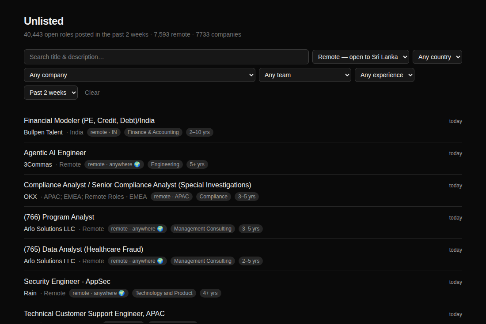

# Unlisted

**Fresh roles straight from 7,700+ company career pages, in one search, including
the ones that never reach job boards.**

**Live: [findunlisted.link](https://findunlisted.link)**

Every company's careers page is
hosted by an applicant tracking system (Greenhouse, Ashby, Lever), and that's where
a role appears first. Some are cross-posted to LinkedIn and job boards later; many
never are, and you only find them if you already know the company. Unlisted reads
the career pages directly; it doesn't check whether a role is also on other sites. This pulls every one of those boards into a single
searchable list, keeps only the **past week**, and links each job straight to
the employer's own apply page.



- **Where can I actually work from?** "Remote" often means "remote in the US".
  Each remote job is classified as open to anywhere, to a region (EU, APAC…) or to
  one country, and there's a filter for roles open from Sri Lanka.
- **Experience level** from what the description asks for ("3+ years"), falling
  back to the title.
- **Pay** where the posting states it: Ashby and Lever's pay fields, or the range
  written in the description ("$120,000 - $150,000 USD"), with a filter for it.
- **Each role once.** A company posting the same role for twelve cities shows up
  as one row, "+11 more locations", instead of twelve.
- **For you:** a second feed ranked for one person. Add the roles you want and
  your skills, or upload a CV to fill them in, and every role is scored on how
  well it fits, with the reason under each one. The CV is read in the browser
  and never uploaded. Save roles, hide ones that aren't for you, get notified
  about strong new matches, and open the same profile on another device with an
  emailed link. No account.
- **Follow a search** by email or RSS. "Email me new matches" saves the current
  filters; after confirming, you get one email after each hourly update that
  found something new. Every search also has a feed at `/feed?...`.
- **Only what's still worth applying to.** Of 227,719 open jobs across all boards on
  the first full sync, 82% were posted over two weeks ago. Only the past week is stored.

It's a discovery layer, not an application proxy: no accounts, no tracking, and
every listing links to the real posting. Each job page checks live with the
employer's board that the role is still open, and shows when Unlisted first saw it
next to the employer's posted date.

(The code still calls itself `jobsite`: that's the CLI command and Python package.)

## Quick start

```bash
make up          # start postgres + pgvector (host port 5433; builds db/docker the first time)
make migrate     # apply db/migrations/*.sql
make install     # python venv + web deps
make discover    # probe db/seed/companies.txt -> companies table
make sync        # fetch every board, upsert jobs
make web         # http://localhost:3000
```

## How it works

```
db/seed/companies.txt ──probe──> companies ──sync──> jobs ──> Next.js
   (plain names)                 (ats+token)        (Postgres)
```

**Ingestion** is Python (`workers/`). Connectors turn each ATS payload into one
shared `NormalizedJob` shape and never touch the database; `sync.py` owns all
writes. **The web app** (`web/`) is Next.js reading Postgres directly from server
components — no API layer in between. The only contract is the schema.

### Finding companies

No ATS lets you enumerate its customers, and no public company→token dataset
exists, so this is the hard part. Two paths:

- `jobsite discover` takes **plain company names**, generates slug variants, and
  asks each ATS. It works because Greenhouse/Ashby/Lever return a clean 404 for
  unknown tokens. Boards with zero jobs are rejected — stale empty shells are
  common (Vercel has an empty Ashby board beside its real Greenhouse one), so the
  highest job count wins.
- `jobsite add-url` (and the admin page) takes a careers URL for the long tail,
  where the slug isn't the company name.
- `jobsite import-boards` takes board tokens you already have — either a plain
  token list or a `name,slug,url` CSV. Every token is validated, and anything
  that 404s or returns zero jobs is skipped, so a stale list is harmless.

`db/seed/boards/` vendors Greenhouse, Ashby and Lever lists (11,881 companies)
from [kalil0321/ats-scrapers](https://github.com/kalil0321/ats-scrapers) (MIT) —
see `db/seed/boards/SOURCE.md`. Sample validation found ~87% still live. The CSV
`name` column matters: Ashby's API returns no company name at all, so without it
the board token is the only available label.

Because a full sync of that many boards takes hours, `jobsite sync --limit N`
syncs in chunks, never-synced boards first, so the dataset grows while staying
usable throughout.

### Supported ATSs

| ATS | Public API | Descriptions | Status |
|---|---|---|---|
| Greenhouse | documented | via one `?content=true` board fetch | supported |
| Ashby | documented | inline | supported |
| Lever | documented | inline | supported |
| SmartRecruiters / Workday | public / undocumented | per-job fetch | not yet |
| Jobvite / iCIMS / Teamtailor | key- or partner-gated | — | not planned |

## Remote: open to where?

`remote = true` does not tell you whether you can apply. "Remote - Portugal" and
"Remote: United States" are remote *and* geographically restricted — useless if
you are not in those places. `open_to`
(`workers/src/jobsite/remote_scope.py`) answers the narrower question:

| value | meaning |
|---|---|
| `anywhere` | no geographic restriction stated |
| `region` | restricted to a multi-country region (EU, APAC, LATAM…) |
| `country` | restricted to a single country |
| `NULL` | not remote, or undetermined |

The classifier is **deliberately pessimistic**: a remote job naming any place we
recognize counts as restricted. The stakes are asymmetric — showing a job you
cannot apply to wastes real time, while hiding a vague one costs a little
recall. So `"Argentina - Fully Remote"` and `"Anywhere in Belgium"` are
`country`, not `anywhere`, despite the unrestricted-sounding wording.

The location dropdown exposes **Remote — anywhere** (strictly unrestricted) and
**Remote — open to Sri Lanka** (unrestricted + APAC-wide + India/Sri Lanka).
Every job row shows where it is open to, e.g. `remote · anywhere 🌍` or
`remote · PT`.

## Experience level

No ATS exposes a structured experience field, so it is inferred at ingestion
(`workers/src/jobsite/experience.py`) and stored as a `[min, max]` year range:

1. **Explicit years in the description** — `5+ years`, `3-5 years`, `4 years of
   experience`. Covers ~73% of jobs. Only the first 6000 characters are scanned,
   since requirements appear early and later text ("founded 10 years ago")
   produces false positives. Where several requirements are listed, the lowest
   is taken as the real entry bar.
2. **Seniority words in the title** — Intern/New Grad → 0-1, Junior → 0-2,
   Senior → 5+, Staff/Principal → 8+, Director/VP → 10+. Adds ~12%.
3. Otherwise unknown (~15%), filterable as "Not stated".

`exp_source` records which path was used; title-inferred levels are marked with
`*` in the list and "(inferred)" on the detail page.

**Bucket matching differs by kind.** Bounded buckets (`0-1`, `1-2`, `3-5`) match
by *overlap*, so filtering `3-5` surfaces a job wanting 2-6 years and an
open-ended `5+` one you would still qualify for. The open-ended `5+` bucket
instead requires `exp_min_years >= 5` — pure overlap would drag in a "1-8 years"
role, which is not a 5+ job.

## Pay

Stored as `comp_min`, `comp_max`, `comp_currency` and `comp_period` (year, month
or hour), base pay only:

1. **Ashby** lists pay as components, sometimes equity or bonus first; only a
   `Salary` component counts. **Lever** has an optional `salaryRange`.
2. **Everything else** is read from the description (`workers/src/jobsite/pay.py`).
   About half of Greenhouse postings state a range, mostly because of US pay
   transparency laws. A wrong figure is worse than none, so a range needs a
   currency and both ends plausible for its period; a lone figure only counts
   right after "salary", "base pay" and the like; OTE and "+ $X variable" are
   skipped. A bare `$` follows the job's country (CAD in Canada, AUD in
   Australia).

The pay filter's `$100K+` tiers mean the top of the range reaches the figure,
in US dollars a year; other currencies aren't converted.

Pay read from the text is left out of the job's change fingerprint: it adds
nothing the description doesn't already cover, and leaving it in would make
the next sync rewrite every job with pay at once, more than the 512 MB database
has room for. `jobsite backfill-pay` fills it in for jobs stored earlier, in
batches with a `VACUUM` after each.

## For you

`/for-you` ranks every listed role for one person. Each role gets a score from
four signals (`web/src/lib/match.ts`):

| Signal | Points | From |
|---|---|---|
| Role | 3 | the title names a role they want ("Engineer" and "Developer" count as one) |
| Skills | up to 2 | how many of their skills the posting mentions, full marks at 5 |
| CV | up to 4 | how close the posting reads to their CV (embeddings) |
| Fresh | up to 1 | halves every two days |

A role needs 1.5 points from the first three to be shown, so the feed is what
fits, not everything sorted. Preferences (where, country, pay) filter as on the
home page; experience is softer: roles that don't state it stay in, a year over
is fine, and early careers don't see senior titles. Each row says why it's
there: the role and skills that matched, and "close to your CV".

**The CV never leaves the browser.** pdf.js or mammoth pulls the text out,
`web/src/lib/catalog.ts` finds the roles, skills (about 220 named ones, with
aliases) and years of experience in it to prefill the form, and
[Transformers.js](https://huggingface.co/docs/transformers.js) runs
`all-MiniLM-L6-v2` on it (8-bit, 23 MB, downloaded once). Only the chips the
person keeps and the 384 numbers are saved.

**Jobs are embedded by the worker**: `jobsite embed` runs the same model through
fastembed (ONNX Runtime, no PyTorch) on the title, twice, and the first ~1,000
characters of the description, and stores a `halfvec(384)` with pgvector, about
10 MB for a week of jobs. fastembed's output matches the browser's
full-precision model to five decimals; the browser's 8-bit one is 0.994
cosine-similar. There's no vector index: the feed filters first and compares a
few thousand rows exactly. Calibrated on a backend engineer's CV and a nurse's:
the median job scores 0.19 to 0.26, the closest 1% 0.39 to 0.48, so 0.3 is
worth nothing and 0.6 full marks.

**Two things made the query fast** (8 s to ~100 ms): skills and roles are looked
up one at a time through the GIN indexes before joining (testing every row's
`search_tsv` unpacks that large out-of-line column per skill per row, which the
planner doesn't cost), and JIT is off for it (Postgres guessed the query was
expensive and spent 2 s compiling it).

**Profiles without accounts.** A profile is a row keyed by a random token in an
`httpOnly` cookie. "Use on another device" emails a single-use, 30-minute link;
opening it is a button press, so mail scanners can't use it up. "Not for me"
hides a role (all its postings); saved roles keep a copy of the title and link,
since jobs are deleted after a week. "Notify this device" on the feed sends a push
notification after each sync when a new role scores 3 or more. Profiles unused
for six months are deleted.

## Design decisions worth knowing

**Only the past week.** Within a week or two most roles have hundreds of
applicants, so older ones are noise. Sync skips jobs posted more than
`MAX_JOB_AGE_DAYS` (default 7; it was 14 until two weeks of every board outgrew
Neon's free 512 MB) ago, and every sync ends with a prune that deletes jobs that have
aged out since. Age is `posted_at`, or `first_seen_at` when the ATS gives no
date. This also keeps the database small (1.16 GB for every open job vs. a
fraction of that for one week), and the web app applies the same window so
pages are right between syncs.

**Closed, not deleted, within the window.** A job missing from a sync is stamped
`closed_at`; if it reappears, the upsert reopens it.

**The empty-board guard.** If a board returns zero jobs while we hold more than
five open ones, the run is marked `suspicious` and closes nothing. Without this,
one bad upstream response would silently wipe a company's entire board.

**`left(description_text, 200000)` in the search column is required**, not
defensive padding. `tsvector` caps at ~1MB and the column is `GENERATED ALWAYS`,
so one oversized description would fail the whole insert.

**`array_to_string` can't be used in that generated column** — it is only
`STABLE`, not `IMMUTABLE`, and Postgres rejects it. `location_raw` feeds the
search vector instead; `locations[]` filtering goes through a GIN index.

**nh3, not bleach.** bleach is marked inactive on PyPI and ships no further
security fixes. Sanitizing untrusted third-party HTML is a security boundary.

**Ashby sets `isRemote: true` on hybrid roles**, so `workplaceType` is treated as
the authority — otherwise hybrid jobs pollute the remote filter.

**Keyset pagination, not OFFSET.** Verified to run as an Index Only Scan on the
partial index.

## Public deployment

The public copy runs on free tiers, with the same schema and sync code as local:

```
GitHub Actions (hourly) ──sync──> Neon Postgres (free, 512 MB) <──reads── Vercel (Next.js, read-only)
```

- **Database:** Neon's free tier caps a project at 512 MB. Two weeks of every board
  was about 390 MB freshly loaded (raw ATS payloads left out with `STORE_RAW=false`,
  description words indexed without positions, sync logs kept for 6 hours; see
  migrations 0006 and 0008), but updates leave old row versions behind that
  Postgres reuses and never hands back, and it reached 489 MB in a day. Hence one
  week, about half the jobs. A schema change that
  rewrites the jobs table needs `db/deploy/reset-jobs.sql` first (it refills on the
  next sync).
- **Sync:** `.github/workflows/sync.yml` runs every hour (at :23, sometimes a little
  late: GitHub schedules are best-effort). `jobsite sync --due` checks boards with open
  jobs every run and quiet boards every ~6 hours, about 5,200 of 7,733 per run. It
  downloads everything with no database connection open (~15-20 min, set by the
  per-ATS rate limits), then writes in one burst of under a minute, so Neon is awake
  for minutes per run and the free compute allowance holds. Secret: `DATABASE_URL`.
  GitHub pauses scheduled workflows after 60 days without a commit, so it needs
  re-enabling after a quiet spell.
- **Site:** Vercel, root directory `web`, with `DATABASE_URL` and
  `JOBSITE_READ_ONLY=1`. Read-only mode returns 404 for the admin page and its API,
  which run the CLI on the server and have no auth.
- **Email alerts** and sign-in links go out through Resend or Gmail (see
  [Email](#email)). Vercel needs `ALERTS_SECRET`, and GitHub needs the same
  `ALERTS_SECRET` as a secret. After each sync the workflow POSTs to
  `/api/alerts/send`, which runs the same filter code as the search page.
  Signing up only sends a confirmation email; nothing else is sent until it's
  clicked.
- **App and push alerts:** the site is a PWA (manifest, `public/sw.js`), so
  phones can install it from the browser ("Install app" on Android, Share → Add
  to Home Screen on iPhone). "Notify this device" saves the search with the
  browser's push subscription and the same `/api/alerts/send` call sends web
  push notifications: free, no daily cap, no confirmation email. Vercel needs
  `NEXT_PUBLIC_VAPID_PUBLIC_KEY` and `VAPID_PRIVATE_KEY` from
  `npx web-push generate-vapid-keys` (redeploy after setting them: the public
  key is built into the page). iPhones only get push once the site is on the
  home screen.
- **For you:** migration 0012 enables pgvector (Neon has it). The workflow
  installs `workers[embed]`, caches the model, and runs `jobsite embed` after
  each sync (at most 15 minutes, so a refilled table is embedded over a couple
  of runs). Sign-in links use the same Gmail settings as alerts.
- **Companies** are managed locally. `make push-companies DEPLOY_URL=...` copies new
  ones to the deployed database (existing ones are left alone).

```bash
make deploy-migrate DEPLOY_URL="postgresql://..."    # once, then the workflow keeps it current
make push-companies DEPLOY_URL="postgresql://..."
```

## Email

Templates are [React Email](https://react.email) components in
`web/src/emails/` (alert, confirm, sign-in): typed, in the same codebase as the
pages, rendered to email-safe HTML with inline styles plus a plain-text part.
Preview them locally at `/api/dev/emails` (`?name=alert`, `&format=text`).

`web/src/lib/mail.ts` sends through the first one that's set up:

| Provider | Vercel settings | Free limit (site caps at) |
|---|---|---|
| Resend | `RESEND_API_KEY`, `MAIL_FROM` ("Unlisted <alerts@mail.yourdomain.com>") | 3,000 a month, 100 a day (95) |
| Gmail SMTP | `SMTP_USER`, `SMTP_PASS` (a Google app password) | ~500 a day (450) |

`MAIL_REPLY_TO` is optional, and `MAIL_DAILY_LIMIT` overrides the cap.
Locally, with neither set, emails are printed to the terminal.

**Resend needs a domain you own.** Without one it only delivers to your own
address, so `*.vercel.app` won't do; any cheap domain works. In Resend, add a
sending subdomain such as `mail.yourdomain.com` (a subdomain keeps the alert
reputation apart from the main domain) and copy the records it shows into the
domain's DNS:

- **DKIM** (`TXT resend._domainkey.mail`): signs every email, so mail apps can
  tell it really came from you. The biggest single factor.
- **SPF** (`MX` and `TXT` on `send.mail`): says Resend may send for the domain.
- **DMARC** (`TXT _dmarc`, add it yourself): `v=DMARC1; p=none; rua=mailto:you@yourdomain.com`.
  Gmail and Yahoo require one from senders. Move to `p=quarantine` once
  reports show only your own mail.

What the code already does for the inbox: a plain-text part next to the HTML,
one-click unsubscribe headers on alerts (RFC 8058, required by Gmail and Yahoo
for bulk mail), a unique `X-Entity-Ref-ID` so alerts aren't folded into one
thread, double opt-in (an address gets nothing until it confirms), a daily cap,
and one consistent sender. Check a real email at
[mail-tester.com](https://www.mail-tester.com) once DNS is in: it scores SPF,
DKIM, DMARC and content.

## Commands

```bash
jobsite discover --seeds ../db/seed/companies.txt
jobsite add-url https://jobs.ashbyhq.com/linear     # or just: jobsite add-url Linear
jobsite import-boards db/seed/ashby_boards.txt --ats ashby
jobsite sync [--company X] [--stale-hours 6]      # skips and prunes jobs older than 7 days
jobsite prune                                      # just the prune
jobsite backfill-pay                               # one-off: pay for jobs stored before pay.py
jobsite embed                                      # embeddings for "For you" (pip install -e "workers[embed]")
jobsite stats
python -m jobsite.scheduler                          # sync every 6h
```

## Tests

```bash
make test    # 166 tests (connector fixtures under workers/tests/fixtures; the age
             # test uses the dev database and is skipped when it's not running)
```

Covers location normalization, HTML sanitization, connector normalization,
experience inference, and URL parsing — the parts where real-world data is messy
enough to break things.

## Being a good citizen

These are public, documented, unauthenticated job-board APIs, serving data
companies are paying to broadcast, and every listing links back to the employer's
own apply page. The client sends a contactable User-Agent, rate-limits per ATS
(5 req/s), honors `Retry-After`, backs off on 429, and syncs every 6 hours locally
and hourly for the public copy (quiet boards every ~6 hours), rather than constantly. Undocumented endpoints (Workday et al.) are deliberately
deprioritized and would get a lower limit.
